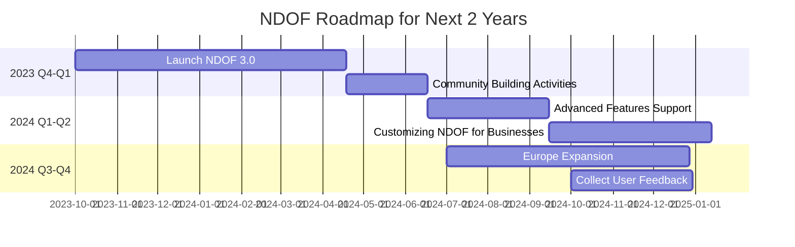

# [roadmap NDOF project](https://roadmap.ndof.org/)

This roadmap starts from 2023 Q4 and goes through 2024. It shows the target for launching a new version of NDOF 3.0, building activities, advanced features support, customization for businesses, market expansion, and user feedback collection.

Roadmap for Next 2 Years:

2023:
Q3-Q4:
- Launch of NDOF Version 2.0 with enhanced functionalities.
- Initiate user community building activities and webinars to introduce new features.

2024
Q1-Q2:
- Collect user feedback and identify areas for improvement.
- Integrate suggested improvements and release updated version.

2024:
Q3-Q4:
- Introduce advanced features in NDOF to support more data formats.
- Partnering with businesses to understand their specific needs and customizing NDOF accordingly.

2025
Q1-Q2:
- Focus on market expansion to reach more businesses in need of efficient data-streaming solutions.
- Evaluate performance, collect user feedback, and make necessary improvements.
